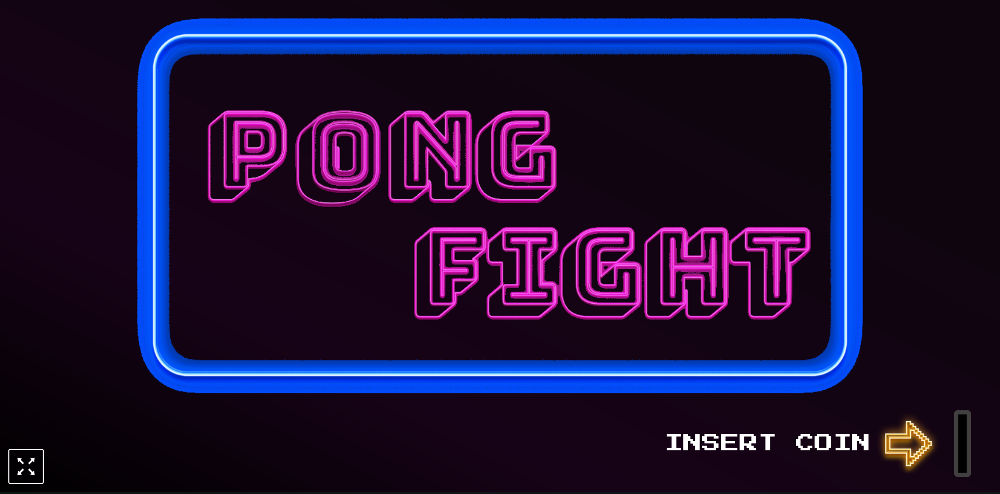
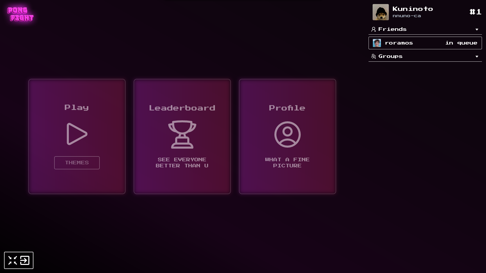
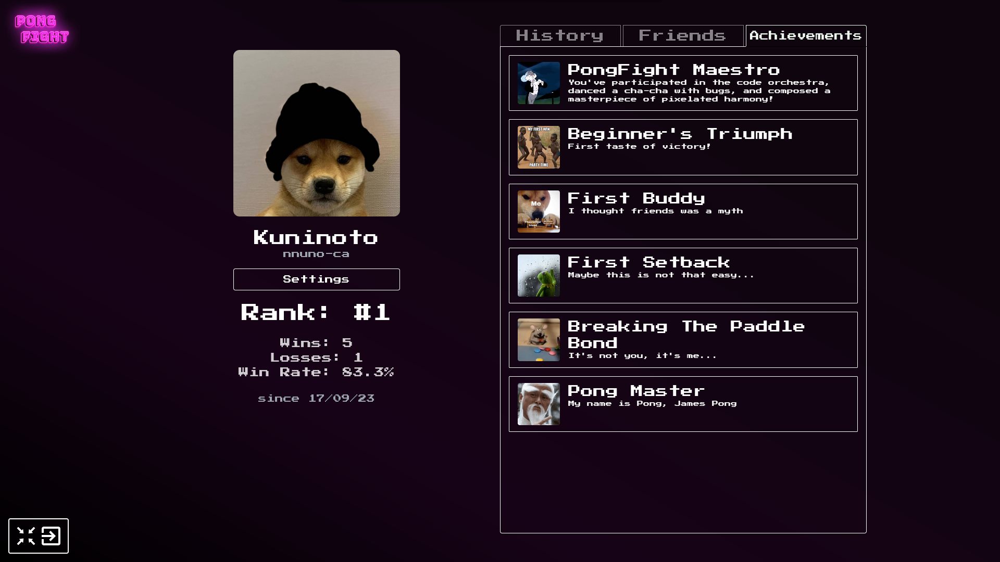

# ft_transcendence (42Porto - 42Cursus)  

#### Project done in collaboration with  
[Rodrigo Ramos](https://github.com/ramos21rodrigo)  
[João Arsénio](https://github.com/RealMadnessWorld)  

### Demonstration  
  
  
  

### Overview  
A website to host the might pong contest!  

> Disclaimer: Only tested on Google Chrome and Brave (Also works on Firefox but has a **visual** bug on user's profile avatar update field)

### Stack Used  
&nbsp; &nbsp; &nbsp;  
&nbsp;
&nbsp;
  

### Features
- User accounts/profiles and relations (friendships & blocks)  
- OAuth2 Login with 42's intranet and 2FA with Google Authenticator  
- Chat (groups with roles (owner, admin and participant) and DMs)  
- Pong game (with themes!)  
- Matchmaking, 1v1 and match history  

## Grade: 100/100  

### Installing and running the project  
1- Install Docker: [install Docker engine official docs](https://docs.docker.com/engine/install/)  
2- Clone this repository

    git clone https://github.com/Kuninoto/42_ft_transcendence ft_transcendence
3- Navigate to _ft_transcendence_

    cd ft_transcendence
4- Write a `.env` file on `/backend` and `/frontend` like the `.env.example`(s) to use your very own configurations  
5- Run the containers

    docker-compose up --build

## Useful links  

**General**  
[Web Development 10min Overview](https://youtu.be/5YDVJaItmaY)  
[100+ Web Development Things you Should Know](https://youtu.be/erEgovG9WBs)  

[Frontend Overview](https://youtu.be/WG5ikvJ2TKA)  
[Backend Overview](https://youtu.be/XBu54nfzxAQ)  

[JavaScript 101](https://youtu.be/lkIFF4maKMU)  
[Arrow functions in JavaScript](https://youtu.be/kzzkrhzGpkg)  
[JavaScript Promises in 10 Minutes](https://youtu.be/DHvZLI7Db8E)  
[JavaScript Promises in 10 Seconds](https://youtu.be/RvYYCGs45L4)  
[Async Await and Promises](https://youtu.be/vn3tm0quoqE)  

**NestJS**  
[NestJS explained in 100 seconds](https://www.youtube.com/watch?v=0M8AYU_hPas)  
[NestJS Tutorial for Beginners](https://www.youtube.com/watch?v=oU5Di3be-Sk&list=PLS1QulWo1RIbihafA6GlwyvmwkHshmVyh&pp=iAQB)  
[Custom Decorators NestJS Docs](https://docs.nestjs.com/custom-decorators)  
[Serve Static NestJS Docs](https://docs.nestjs.com/recipes/serve-static)  
[Official Docs](https://docs.nestjs.com/)  

**User Auth**  
[Introduction to OAuth 2.0](https://www.digitalocean.com/community/tutorials/an-introduction-to-oauth-2)  
[Session vs Token Authentication in 100 Seconds](https://www.youtube.com/watch?v=UBUNrFtufWo)  
[Session vs Token based authentication](https://www.geeksforgeeks.org/session-vs-token-based-authentication/)  
[NestJS Tutorial - Setting up Passport, OAuth2, TypeORM, Sessions, Session Store, Database](https://www.youtube.com/watch?v=vGafqCNCCSs)  
[Introduction to JWT](https://jwt.io/introduction/)  
[JWT Authentication best practices](https://blog.logrocket.com/jwt-authentication-best-practices/)  
[JWT usage vs. Session](https://stackoverflow.com/questions/43452896/authentication-jwt-usage-vs-session)  
[JWT vs. Opaque tokens](https://zitadel.com/blog/jwt-vs-opaque-tokens)  
[Passportjs serializerUser and deserializeUser](https://stackoverflow.com/questions/29066348/passportjs-serializeuser-and-deserializeuser-execution-flow)  
[2FA with Google](https://dev.to/hahnmatthieu/2fa-with-nestjs-passeport-using-google-authenticator-1l32)  
[NestJS passport docs](https://docs.nestjs.com/recipes/passport)  

**Chat & Game (WebSockets/Socket.IO)**  
[A Beginner's Guide to WebSockets](https://www.youtube.com/watch?v=8ARodQ4Wlf4)  
[WebSockets in 100 Seconds & Beyond with Socket.io](https://www.youtube.com/watch?v=1BfCnjr_Vjg)  
[NestJS WebSockets Tutorial Playlist](https://www.youtube.com/watch?v=0zyYhm5MjJ4&list=PLBHzlq7ILbsaL1sZxJIxrc4ofSPAMSTzr&pp=iAQB)  
[Full Socket.io and React.js Online Multiplayer Tic-Tac-Toe Game | Socket.io From Zero To Hero](https://www.youtube.com/watch?v=aA_SdbGD64E)  

**Database**  
[SQL explained in 100 seconds](https://youtu.be/zsjvFFKOm3c)  
[7 Databases Overview](https://youtu.be/W2Z7fbCLSTw)  
[Dockerhub Postgres image](https://hub.docker.com/_/postgres/)  
[How to Use the Postgres Docker Official Image](https://www.docker.com/blog/how-to-use-the-postgres-docker-official-image/)  
[PostgreSQL CLI Cheat Sheet](https://tomcam.github.io/postgres/)  
[PostgreSQL Official Docker Image Docs](https://github.com/docker-library/docs/blob/master/postgres/README.md)  
[Difference between one-to-many and many-to-one](https://stackoverflow.com/questions/4601703/difference-between-one-to-many-and-many-to-one-relationship)  

**Adminer**  
[Definition](https://en.m.wikipedia.org/wiki/Adminer)  
[What is Adminer and how to use it](https://kinsta.com/blog/adminer/#what-is-adminer)  
[Connection Adminer to Postgresql](https://www.reddit.com/r/docker/comments/g77ldf/connect_adminer_to_postgresql/)  
[Setup Adminer with docker for database managment](https://dev.to/codewithml/setup-adminer-with-docker-for-database-management-4dd2)  

**Gluing the pieces together**  
[NestJS, TypeORM and PostgreSQL full example development and setup](https://medium.com/@gausmann.simon/nestjs-typeorm-and-postgresql-full-example-development-and-project-setup-working-with-database-c1a2b1b11b8f)  
[Setting up NestJS with PostgreSQL](https://blog.devgenius.io/setting-up-nestjs-with-postgresql-ac2cce9045fe)  

---
Made by Nuno Carvalho (Kuninoto) | nnuno-ca@student.42porto.com  

 <a href="https://www.linkedin.com/in/nuno-carvalho-218822247"/> &nbsp;
